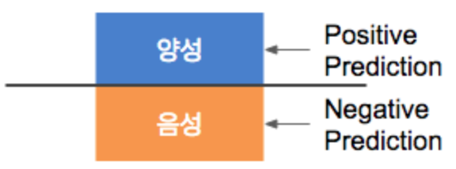
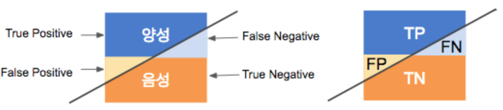
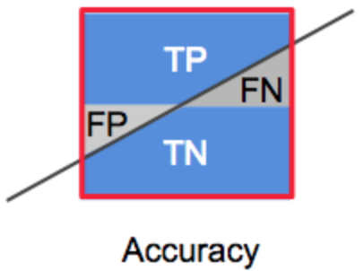
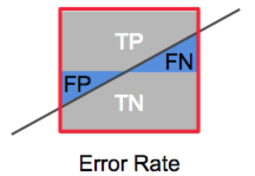
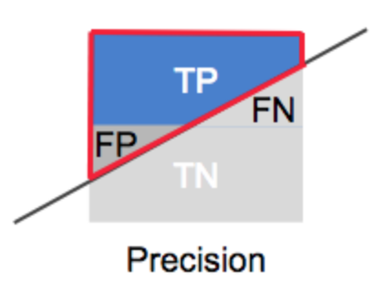

## Confusion Matrix

이진 분류 모델에서 암의 양성과 음성 데이터를 잘 분류하는 모델(100%로 분류)을 가정하면 그림과 같다.
  

  
  
하지만 실제 세계에서 정확도 100%인 모델은 매우 드문 케이스, 따라서 아래 그림과 같이 예측된다.

  

  
  
  
이를, 테이블로 표현하면 다음과 같다.

  

* True Positive(TP) : 양성(true)을 양성(true)으로 예측 = good  
* False Positive(FP) : 음성(False)을 양성(true)으로 예측 = wrong  
* False Negative(FN) : 양성(true)을 음성(false)으로 예측 = wrong  
* True Negative(TN) : 음성(false)을 음성(false)으로 예측 = good  
* Positive(P) = TP + FN  
* Negative(N) = FP + TN  
  
  
이제 이 지표로 모델을 평가해보자.
-------------------------------------------------
1. Accuracy  
전체 데이터 중에서, 제대로 분류된 데이터의 비율  
ACC = (TP + TN) / (P + N)  

            
2. Error Rate  
Accuracy와 반대로, 전체 데이터 중에서 잘못 분류한 비율  
ERR = (FN + FP) / (P + N)  

3. Precision  
정밀성, Positive로 예측한 내용 중에 실제 positive의 비율  
Precision is about being precise. In common English, being precise means:   
if you give an answer, the answer will very likely be correct.   
So even if you answered only one question, and you answered this question correctly, you are 100% precise.  
PREC = TP / (TP + FP)  

4. Sensitivity(Recall or True positive Rate)
민감도, 모델이 얼마나 정확하게 positive 값을 찾았는가
Recall (as opposed to precision) is not so much about answering questions correctly 
but more about answering all questions that have answer "true" with the answer "true". 
So if we simply always answer "true", we have 100% recall.
SN = TP / P
[그림6]

5. Specificity(True negative rate)
특이도, negative로 예측한 내용 중에 실제 negative의 비율
SP = TN / (TN + FP) = TN / N
[그림8]

6. ROC & AUROC(Area Under the Receiver Operating Characteristic curve)
가로축을 FP Rate(Specificity), 세로축을 TP Rate(Sensitive)로 시각화 한 그래프
*Specificity= TN / N
*Sensitive = TP / P
[그림9]
[그래프1]
*민감도, 특이도가 '1'일때 가장 성능이 좋음으로 가로축을 1-Specificity 로 표현하면
X = 0, Y= 1일때 최고의 성능을 나타냄을 보일 수 있다.
즉, AUROC로 면적이 '1'일때 최고의 성능을 나타낸다.
*AUROC = 0.5인 부분은 민감도와 특이도를 동시에 높일 수 없는 기준이다.

7. Precision Recall Rlot & AUPR(e Area Under the Precision-Recall curve)
가로축을 Recall, 세로축을 Precision으로 시각화한 그래프
* Sensitive(Recall) = TP / P
* Precision = TP / (TP + FP)
[그래프2]
*주로 데이터 라벨의 분포가 심하게 불균등할때 사용한다.
예를 들어, 이상 거래 검출 시나리오의 경우 정상 거래의 비율이 비정상 거래에 비해서 압도적으로 많기 때문에(98%, 2%) 
이런 경우 ROC 그래프보다 PR 그래프가 분석에 더 유리하다.
*그래프 위쪽으로 갈수록 정확도가 높은 모델이고 AUC(면적)값을 이용하여 모델의 정확도를 평가할 수 있다.
*ROC의 경우 X=Y 그래프를 기준으로 그래프의 위쪽이 좋은 모델이라면, 
PR의 경우 Baseline을 기준으로 모델의 정확도를 평가한다.
보통, Baseline = P / (P + N)으로 정한다.

[출처]
http://bcho.tistory.com/1206
[참고문헌]
Confusion matrix https://classeval.wordpress.com/introduction/basic-evaluation-measures/
ROC Plot https://classeval.wordpress.com/introduction/introduction-to-the-roc-receiver-operating-characteristics-plot/
Precision Recall Plot https://classeval.wordpress.com/introduction/introduction-to-the-precision-recall-plot/
Precision, Recall, F-Score  http://daeson.tistory.com/197
https://datascienceschool.net/view-notebook/661128713b654edc928ecb455a826b1d/
