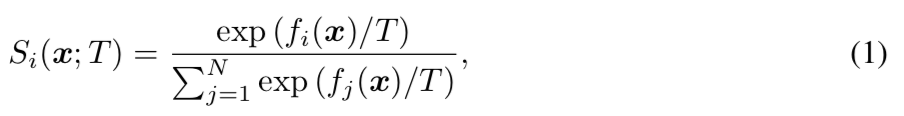
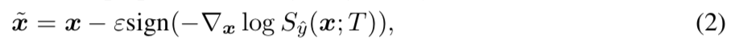
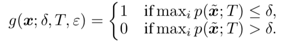

ENHANCING THE RELIABILITY OF OUT-OF-DISTRIBUTION IMAGE DETECTION IN NEURAL NETWORKS

[Paper] https://arxiv.org/pdf/1706.02690.pdf

### -Abstact
We propose a simple and effective method, ODIN(Out-of-Distribution detector for Neural Networks),
for detecting out-of-distribution examples in neural networks. Our method does net require
re-training the neural network and is easily implementable on any modern neural architecture.

## 1. Temperature Scaling  
A good manipulation of tmeperature T can push the softmax scores of in- and out-of-distribution images
further apart from each other, making the out-of-distribution images distinguishable.

## 2. Input Preprocessing  
Note that the pertubations can be easily computed by back-propagating the gradient of the cross-entropy loss
w.r.t the input.

## 3. Out-of-distribution detector  
 3-1) calculate the preprocessed image x^ according to the equation (2).  
 3-2) feed the preprocessed images x^ into the nerual network, calculate its softmax score S(x^; T)  
 3-3) compare the socre to the threshold δ.  
 
 

We say that the image x is an in-distribution example if the softmax score is above the threshold and 
that the image x is an out-distribution example, otherwise.  

  
  
## Question  
1) Temperatue scaling의 증명  
2) Input preprocessing과정에서 theta의 의미  
3) Input preprocessing 식에서 sign 함수의 의미  
