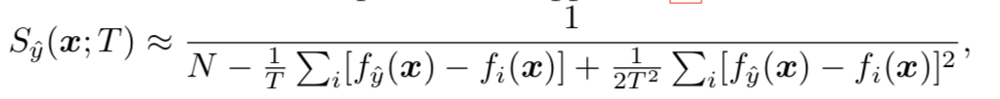
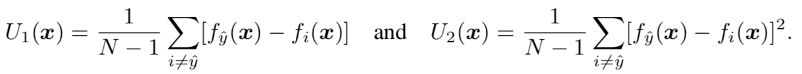

ENHANCING THE RELIABILITY OF OUT-OF-DISTRIBUTION IMAGE DETECTION IN NEURAL NETWORKS

[Paper] https://arxiv.org/pdf/1706.02690.pdf

## Abstact
We propose a simple and effective method, ODIN(Out-of-Distribution detector for Neural Networks),
for detecting out-of-distribution examples in neural networks. Our method does net require
re-training the neural network and is easily implementable on any modern neural architecture.

### 1. Temperature Scaling  
A good manipulation of tmeperature T can push the softmax scores of in- and out-of-distribution images
further apart from each other, making the out-of-distribution images distinguishable.

### 2. Input Preprocessing  
Note that the pertubations can be easily computed by back-propagating the gradient of the cross-entropy loss
w.r.t the input.

### 3. Out-of-distribution detector  
 3-1) calculate the preprocessed image x^ according to the equation (2).  
 3-2) feed the preprocessed images x^ into the nerual network, calculate its softmax score S(x^; T)  
 3-3) compare the socre to the threshold δ.  
 
 

We say that the image x is an in-distribution example if the softmax score is above the threshold and 
that the image x is an out-distribution example, otherwise.  

  
  
## Question  
1) Temperatue scaling의 증명  
=> 식(1)을 테일러 급수를 사용해 전개하여  

U1(X), U2(X)로 간략화,  

=> By definition, U1 measures the extent to which the largest unnormalized  
   output of the neural network deviates from the remaining outputs; while U2 measures the extent  
   to which the remaining smaller outputs deviate from each other.  
=> in-distribution case의 경우, nn의 가장 큰 output은 나머지 output보다 훨씬 더 크다. Figur5-(a)  
   이는 nn이 in-distribution은 높은 confident prediction을 하기 때문이다.  
=> 또한, 이미지의 U1값이 비슷하다면 in-distribution image는 out-distribution image보다 큰 E[U2|U1]값을 가진다.  
   이는 in-distribution image의 remaining output(excluding the largest output)이 out-distribution image 보다 더 잘 구분됨을 뜻한다. 
=> 다시 [식4]를 간략화 하여 [식6]으로 나타내면 softmax score는 U1과 U2/2T에 비레한다.
=> 그리고 U1은 in-distribution image가 out-distributin image보다 높은 softmax score를 갖도록 만들고, [S 비례 U1]
=> U2는 정반대의 효과를 가진다. [S 비례 -U2]
=> 따라서, 충분히 큰 T값을 선택하는 것이 in-distribution과 out-distribution의 softmax socre의 차이를 크게 만든다.
=> 그리고, T값이 충분히 커지면 결국 softmax score는 U1에 영향을 받음으로 더 이상 커질 필요가 없다.
2) Input preprocessing 과정에서 theta의 의미  
3) Input preprocessing 식에서 sign함수의 의미  
//
Input preprocessing 의 효과?
=> T가 어느정도 커지면 효과가 없기에 또 다른 직관을 설명함
=> in-distribution과 out-distribution의 softmax score가 비슷할 때 in-distribution image의 [식#]의 값이 더 큰 것을 볼 수 있음
=> 따라서 input preprocessing을 거치면 in-distribution의 softmax score가 더 커짐
=> theta값이 충분히 작은 경우 nn의 prediction은 변함이 없음
=> 하지만 theta를 무시할 수 없을 때 [식#]의 변화가 생기고 성능 저하를 유발할 수 있다.

