Cross-entropy loss function

----------------------------

Square loss function과 더불어 양대 손실함수로 사용된다. 
신경망 출력을 확률로 간주할 수 있는 경우에 사용되는 손실함수이다.  

#### Information(정보량)  
어떤 사건을 수치로 나타낸 것, 확률을 이용  

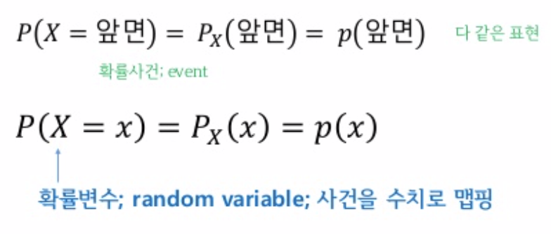

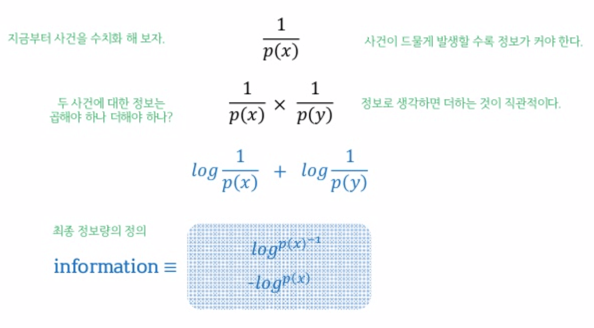

#### Entropy(엔트로피)
정보량의 기댓값  

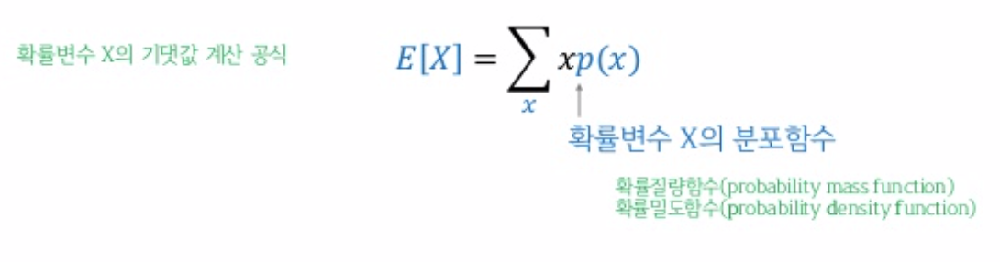

이때, 중요한 것은 확률변수 X의 분포함수  

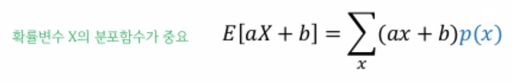

일반화화면, E[f(x)] = sigma(f(x)p(x))  

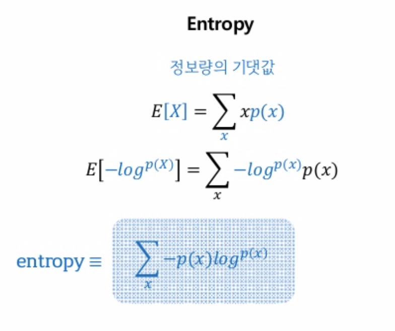

#### Cross-Entropy  
다른 사건의 확률을 곱해서 entropy를 계산한 것  
예를 들어 0 또는 1 만 가지는 확률변수 X가 있을 때,  

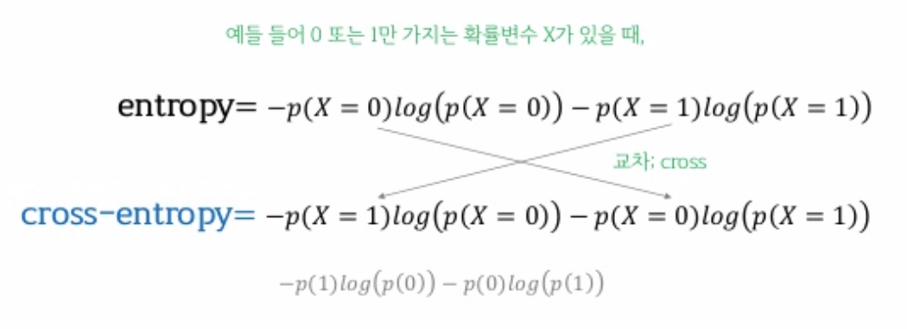

이걸 신경망의 손실함수로 사용해보자!  

가령 신경망의 MSL는  

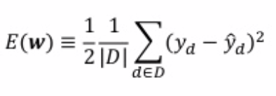

이걸 cross-entropy loss로 대체하면  

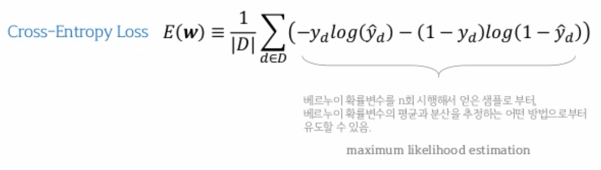

#### 그래프를 통한 Cross Entropy Loss  

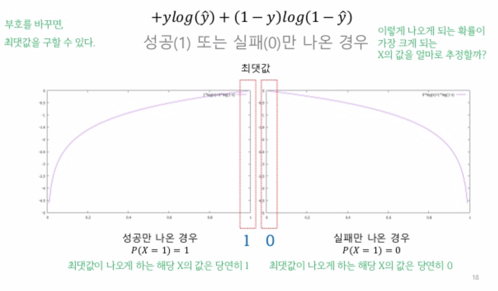

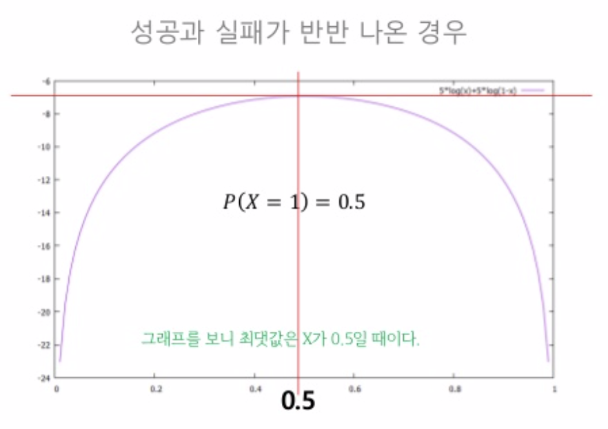

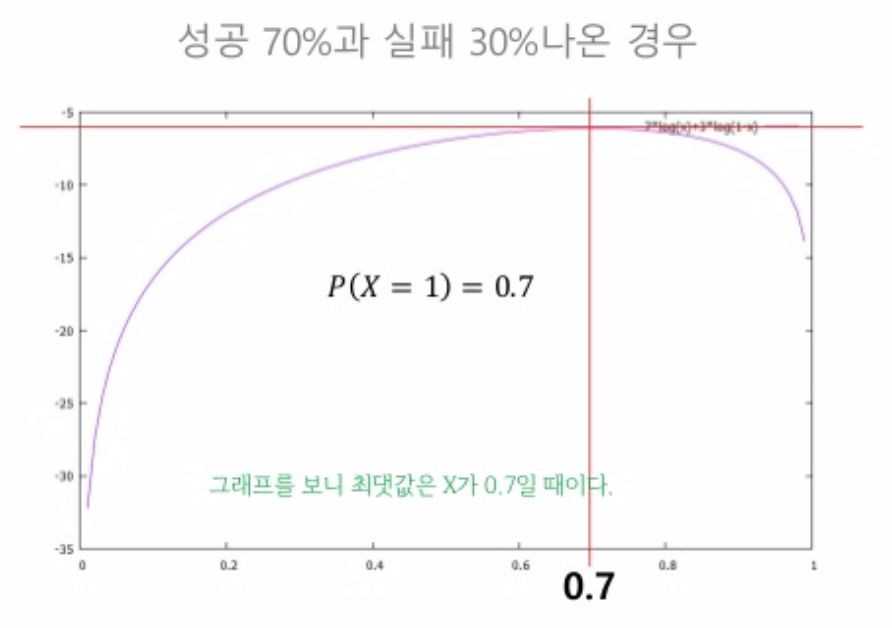

-> 정리하면 신경망 출력이 0 ~ 1 사이로 나오는 경우 loss함수로써 cross entropy loss를 사용할 수 있다.
