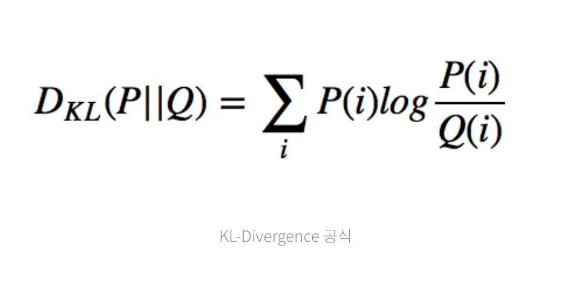
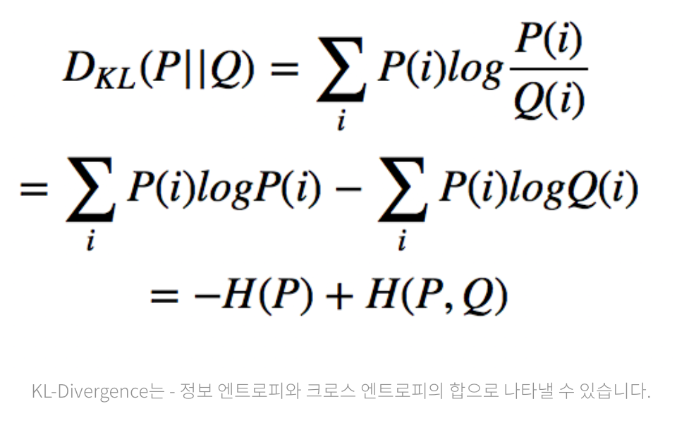

KL Divergence 발산

------------------

두 확률분포의 다름을 설명하기 위한 함수 = 두 확률 분포의 다름의 정도

머신러닝에서는 주로 확인되지 않은 모델을 특정한 확률분포로 근사시키는데 KL-Divergence를 사용한다.  
즉, 실제 데이터를 최대한 잘 설명하는 정규분포를 구하려면, KL-Divergence를 가장 낮게 만드는 정규분포를 구하면 된다.  
KL-Divergence는 상대 엔트로피(Relative Entropy)로도 불린다.

#### 베이지안 추론(Baysian Inference)에서의 KL-Divergence  
Q를 사전확률 분포, P를 사후확률 분포라 할 때
DKL(P||Q) 는 사전확률에서 사후확률로 변하면서 얻은 정보의 양을 해석할 수 있다.  
사후확률(P)는 주로 실제 관찰 데이터(Observation)을 나타낸다.  
사전확률(Q)는 주로 가설, 모델(model) 그리고 P의 근사로 사용한다.  
즉, Q(근사 모델)를 최대한 P(실제 데이터 분포)에 가깝에 만들려면 KL-Divergence를 최소화하도록 학습하면 된다.  

#### KL-Divergence의 특징  
1. 항상 0 이상의 값을 가진다.  
2. 비대칭적이다.  
DKL(Q||P) != DKL(P||Q), --> 비대칭적이기 때문에 두 분포 사이의 거리라고 표현하기는 어렵다.  
3. 두 확률분포가 동일하다면 KL-Divergence값은 0이 된다. 
4. KL-Divergence를 분해하면 정보 엔트로피 + 크로스 엔트로피로 나눌 수 있다.  

*출처 : https://brunch.co.kr/@chris-song/69#comments
