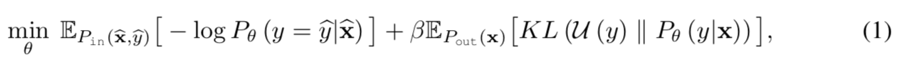
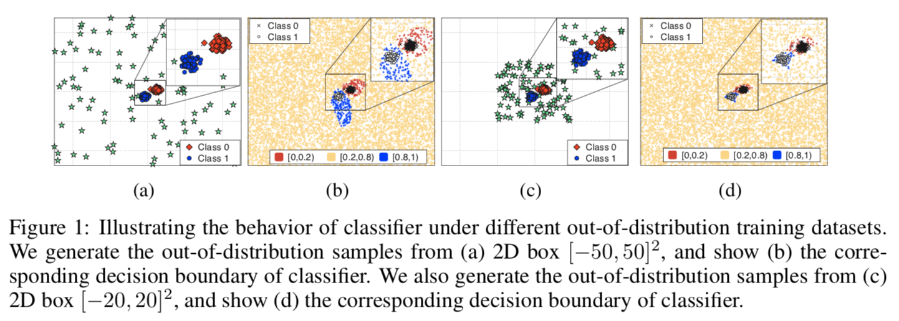
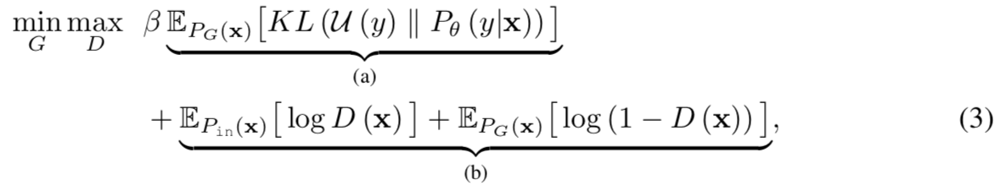
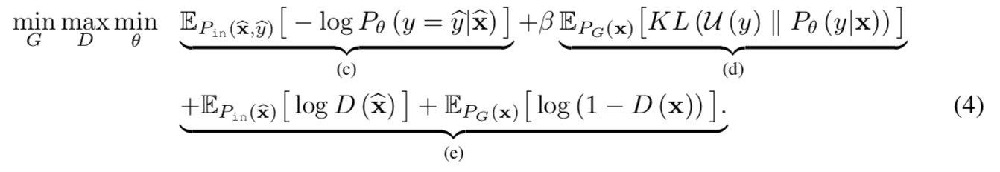
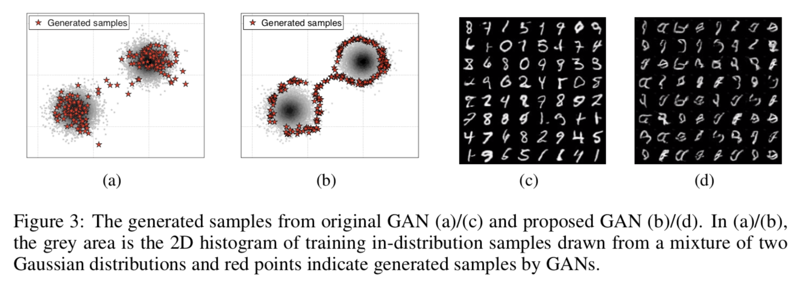
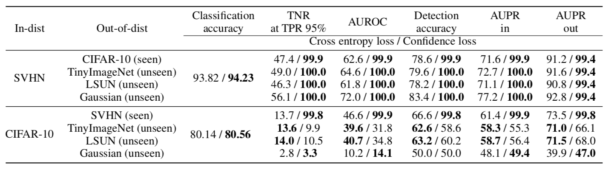

#1 TRAINING CONFIDENCE-CALIBRATED CLASSIFIERS FOR DETECTING OUT-OF-DISTRIBUTION SAMPLES

[paper] https://arxiv.org/abs/1711.09325

## Abstact
We consider a new loss function, called “confidence loss”.  

Our key idea on the proposed loss is to additionally minimize the Kullback- Leibler (KL) divergence from the predictive distribution on out-of-distribution samples to the uniform one in order to give less confident predictions on them. Then, in- and out-of-distributions are expected to be more separable. 

Our motivation is that such inference algorithms can work better if the classifiers are trained so that they map the samples from in- and out-of-distributions into the output space separately. Namely, we primarily focus on training an improved classifier, and then use prior detectors under the trained model to measure its performance.  

Confidence loss는 out-of-distribution에서 예측되는 분포로부터 uniform한 분포로 예측되는 KL 분포의 값을 minimize한다.  
이를 통해 in- and out- distribution을 명확히 구분할 수 있다.  
  
하지만 optimized된 confidence loss값을 찾기 위해서는 무한이 많은 out-of-distribution 데이터가 필요하다.  
이 문제를 해결하기 위해 새로운 generative adversiarial networkd를 제안한다.  

제안되는 GAN은 out-of-distribution data(boundrary samples)를 생성하기 위해 사용된다.  

### 2.1 CONFIDENT CLASSIFIER FOR OUT-OF-DISTRIBUTION

where KL denotes the Kullback-Leibler (KL) divergence, U (y) is the uniform distribution and β > 0 is a penalty parameter. 

새로 제안하는 confidence loss는 out-of-distribution samples에 대해서는 uniform한 형태(zero)를 만든다.   
반면에 in-distribution samples은 label-dependent probability를 따른다.  
in-distribuion smaple은 out-distribution보다 높은 예측값을 출력하 수 있도록 설계되었다.   
KL divergence으로 예측값이 변경될 수 있지만 네트워크의 표현력이 더 강하기 때문에 영향력이 미비한것을 확인했다.  
  
**근데 사실 KLD를 최소화하기 위해서는 거의 무한한 out-distribution 샘플을 학습해야 한다.**  
**but, impossible..    
  
To address the issue, we suggest to sample out-of-distribution close to in-distribution, which could be more effective in improving the detection performance, without any assumption on testing out-of-distribution.  
  
그럼 더 효율적인 out-of-distribution samples을 생성해보자!  

[figure 1]   
(a) [-20, 20]^2 region에서 green samples(out-of-distribution)을 생성한 결과  
(b) 이에 대한 decision boundrary of classifier  
(c) 같은 영역에서 다른 분포로 out-distribution을 생성함  
(d) 이에 대한 decision boundrary of classifier    
  
This implies that training out-of-distribution samples nearby the in-distribution region could be more effective in improving the detection performance. Our underlying intuition is that the effect of boundary of in-distribution region might propagate to the entire out-of-distribution space.  
  
**즉, 분산 영역 근처의 샘플을 학습하는 것이 성능을 향상시키는데 효과적일 수 있고, 근본적인 직관은 분배 영역 경계의 영향이 전체 분배 영역 밖으로 전파될 수 있다는 것이다.  

따라서 이러한 out-distribuion samples를 생성할 수 있는 새로운 GAN을 제안하겠다.   

#### ADVERSARIAL GENERATOR FOR OUT-OF-DISTRIBUTION

Original GAN과 다르게 generator가 분배 성능을 감소시키는 p_out을 생성하도록 만들자. 
where θ is the model parameter of a classifier trained on in-distribution. 

the first term (a) corresponds to a replacement of the out-of-distribution Pout in (1)’s KL loss with the generator distribution PG.

the first term (a)는 식(1)의 KLD손실에서의 out-distribuion(P_out)을 generator의 distirubion(P_g)로 대체한다.
이는 generator를 사용해 in-distribution의 log negative likelihood을 최소화하기 때문에 generator가 low-density sample을 생성하도록 강제한다.
== Pin (x) ≈ exp (KL (U (y) ∥ Pθ (y | x))). 

the second term (b) corresponds to the original GAN loss ==> 그래도 분포에서 벗어나는 샘플을 생성해야지..  
(Suppose that the model parameter of classifier θ is set appropriately such that the classifier produces the uniform distribution for out of distribution samples.). 

정리하면, 생성되는 분포는 in-distribution 샘플로부터 너무 멀리 않도록 생성되야 한다.

그러면 (3)의 KL 분기 항 (a)은 분포가 어긋난 샘플이 생성 되더라도 거의 0입니다. 그러나, 샘플이 경계로부터 멀리 떨어져 있다면, (3)에서의 GAN 손실 (b)은 높아야한다. 즉, 샘플을 갖는 GAN 손실력은 분포 공간으로부터 너무 멀지 않아야한다. 그러므로, 제안 된 손실은 발생기가 배급 공간의 저밀도 경계에있는 샘플을 생성하도록 유도 할 수 있다고 기대할 수있다. 우리는 3.2 절의 실험적 증거도 제공한다.

#### JOINT TRAINING METHOD OF CONFIDENT CLASSIFIER AND ADVERSARIAL GENERATOR

#2 Uncertainty-Aware Learning from Demonstration Using Mixture Density Networks with Sampling-Free Variance Modeling

[paper] https://arxiv.org/abs/1709.02249
