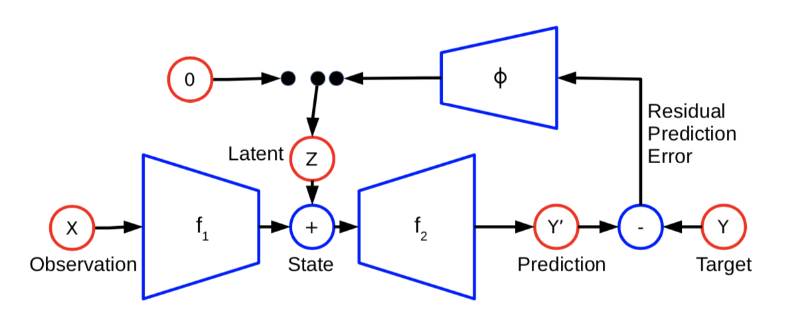

#1 PREDICTION UNDER UNCERTAINTY WITH ERROR- ENCODING NETWORKS

[paper] https://arxiv.org/abs/1711.04994  

시계열 데이터에서 다음 프레임을 예측하기 위한 ERROR ENCODING NETWORKS[ENN] 제안  
  
A major challenge in this task is how to handle the multi-modal nature of many time series. 
By training a model deterministically, we can obtain this factorization in the form of the model’s prediction together with. the prediction error with respect to the true state. 
This error can be encoded as a low- dimensional latent variable which is fed back into the model to accurately correct the determinisic prediction by incorporating this additional information. 
  
--> 확률론적을 학습을 수행해서(Auto Encoder 이야기 하는듯..) 잘못된 예측을 얻으 후 Residual learning으로 이 에러를 저차원의 잠재변수(latent)로  
인코딩하여 정확히 다음 프레임을 예측하 수 있는 형태의 학습 방법을 제안한는듯..   

위의 모델을 EEN으로 부르겠음
해당 모델에서 3가지의 function mappong을 수행하는데..  
1) 현재 상태(current state)를 미래 상태(feature state)로 매핑
--> 첫번째 학습 과정에서 Observation을 auto encoder를 통해 Prediction하는 과정인듯
2) feature state의 non-deterministic을 저차원의 잠재 변술 매핑
--> Redisual Prediction Error를 통해 Latent을 갱신하는 과정인듯
3) feature state의 모드 정보를 인코딩하는 latent vector를 조건으로 하여 current state를 feature state로 매핑
--> 갱신된 latent vector를 통해 다음 프레임을 예측하는 과정인듯

# 결국은 처음의 학습 과정을 통해 예측된 프레임을 Y와의 error를 통해 latent space를 학습시키고 학습된 매개변수를 사용해 infernece과정에서 빠르게 다음 프래임을 예측할 수 있다는 이야기인듯.. #

One natural way of dealing with uncertainty is through latent variables, which can be made to account for aspects of the target that are not explainable from the observed input. 
--> 논문에서는 불확실성을 다루는 하나으 방법으로 잠재 변수를 다룰것을 제안한다.

기존의 전통적인 방법(k-means, mixtures of gaussian)은 잠재 변수와 모델 매개 변수에 대한 손실을 교대로 최소화함으로써 훈련된다. 
확률론적으로 이는 expectation-maximization algorithm이다.

NN 모델의 경우 연속적인 잠재 변수는 경사 하강법으로 최적화 할 수 있고 다음과 같은 학습 절차를 따른다.
Algorithm 1 : Train latent variable model with alternating minimization
First, the latent variable z should represent what is not explainable using the input xi. 
Second, if we are using gradient descent to optimize the latent variables, z will be a continuous function of xi and yi, although a possibly highly nonlinear one. 
--> 결국 기존의 NN은 경사하강법을 사용해 잠재 변수를 최적호 하는데 이럴경우 z는 xi와 yi으 연속 함수가 될 수 있지만 맹 비선형적이 수 있다??

#2 What Uncertainties Do We Need in Bayesian Deep Learning for Computer Vision?

[paper] https://arxiv.org/abs/1703.04977

두개의 메이저타입 모델 불확실성이 있음.
1) 우연적(Aleatoric)
2) 인식론적(epistemic)
인식록전 불확실성은 데이터만 많으면 충분히 설명 가능함
전통인 CV에서는 이를 모델링하기가 어려웠지만 제안하는 베이지안식 학습 도구는 이를 가능하게 함

우리는 위에 두 가지 불확실성을 모델링하는 이점을 연구함
per-pixel semantic segmentation, detph regression tasks 이렇게 두 개로 모델을 연구할거임
우리가 제안하는 불확실성 공식은 학습된 감쇠?(learned attenuation)의 손실 함수로 해석할 수 있음
이를 통해 노이즈에 강력해지고 세그멘테이션과 depth regression에 최신 결과를 볼 수 있을거임

>>
불확실성을 학습하는건 머신러닝에서 매우 중요한 부분임
립러닝은 고차원 데이터를 매핑할 수 있는 강력한 표현력을 학습하는거임
근데 종종 이게 너무 맹목적으로 믿어짐
그래서 최근 자율주행사고나 사람을 고릴라로 인식하는 치명적인 에러가 발생했음
만약에 이런 딥러닝 모델이 불확실성을 높게 예측했다면 예방했을 문제임
>>
불확실성을 정량화하는 작업으로 크게 regression setting(depth regression)과 classification setting(semantic segmentation)으로 나눌 수 있음
기존에 컴퓨터 비전에서는 이를 위해 particle filtering과 conditional random fildes를 이용했음
근데 신경망을 이용하는 최근 딥러닝 방법은 불확실성 표현을 고려도 안할 뿐더러
딥러닝이 받는 정규화된 스코어는 불확실성을 반드시 포함 안하는 스코어임
근데 여기에 베이시안 딥러닝 학습 방법을 적용하면 불확실성을 포착할 수 있음
>>
베이시안 모델링에서 우리는 두종류의 불확실성을 모델링할 수 있음
먼저 Aleatoric 불확실성인데 이건 센서잡음이나 모션노이즈 같은거임
그리고 이것들은 데이터가 아무리 많아도 불확실성을 줄일 수 없음
반면에, epistemic 불확실성은 모델 매개 변수의 불확실성임
이는 수집 된 데이터를 생성한 모델에 대한 무지이며 데이터가 충분히 주어지면 설명할 수 있음
Aleatoric 불확실성 = homoscedastic 불확실성으로 분류되고
epistemic 불확실성 = heteroscedatic 불확실성으로 분류함
말했듯이 heteroscedatic 불확실성은 모델의 입력에 의존하고 이는 비전에서 특히 중요함
예를들어, depth regression에서 인풋 영상의 하이 텍스쳐는 확실한 예측을 가져오는 반면에
특징이 없는 이미지는 불확실성을 가질 수 있음
>>
우린 big data(가령 딥러닝에서 주로 사용하는 이미지 데이터)에서 aleatoric 불확실성을 만드는것이 
설명할 수 없는 불확실성을 모델링하는데 가장 효율적이란것을 보일거임
epistemic 불확실성은 가능한 많은 데이터의 양으로 설명됨
물론, out-of-exmaples은 alteroic 불확실성만으로는 식별될 수 없음
>>
이를위해 unified bayesian deep learning framework를 제공함
이는 인풋데이터를 aleatoric 불확실성으로 매핑하는것을 학습하고
epistemic 불확실성의 근사치를 제공한다.
figure1은 예제임
Cam Vid dataset에서 semantic segmentation을 위한 불확실성을 보여줌
(d)에서 물체 경계와 카메라에서 멀리 떨어져있는 물체에 대한 aleatoric 불확실성을 증가시킴
(e)은 epistemic 불확실성인데 이는 수집된 데이터를 생성한 모델에 대한 무지임
따라서, 시각적으로 세그멘테이션이 어려운 픽실에 대해 불확실성을 증가시켰음
(밝게 빛나는 부분이 불확성이 더 큰 부분인듯..)
>>
정리하면, aleatoric 불확실성과 epistemic 불확실성을 보여주고
aleatoric 불확실성으로 표현되는 노이즈 데이터를 줄임으로써 non-bayesian baselines보다 성능을 1~3% 향상시키며
aleatoric 과 epistemic 불확실성을 특성화하고 각각의 모델 성능과 추론시간을 비교함으로써
두 불확실성의 트레이드-오프 관계를 통해 적절한 절충점을 연구하였음
>>
이전연구는 위의 두 불확실성을 각가 다룸
먼저, epistemic 불확실성은 모델의 가중치에 대한 사전 분포를 구한 다음 일부 데이터에 따라 이런 가중치의 변화 정도를 파악하여 모델링링함
반면에, aleatoric 불확실성은 모델의 산출물 분포에 따라 모델링을 수행함, 예를들면 출력이 가우시안 노이즈로 손상된 것을 모델링하는것임
>>
2.1 Epistemic uncertainty in bayesian depp learning
